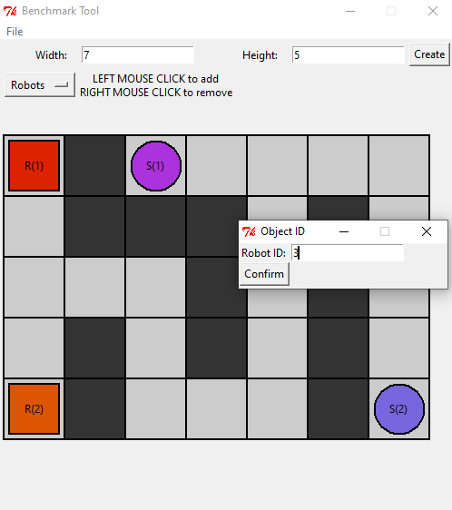

This is a benchmark instance creation tool written in python with GUI for intuitive and easy creation of your custom benchmark instance.

To open the tool, simply run the `python benchmark_tool.py` command or execute the included batch file `run.bat`.

An image of the editor:

The saved instance loaded into the vizualizer:

