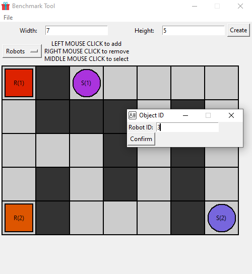
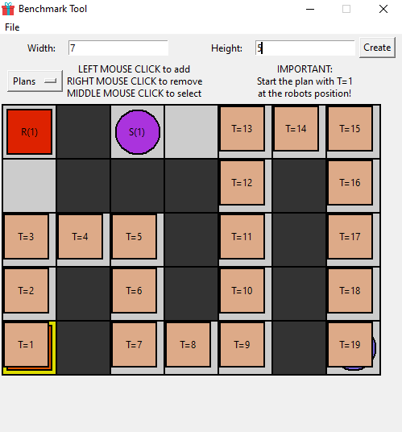
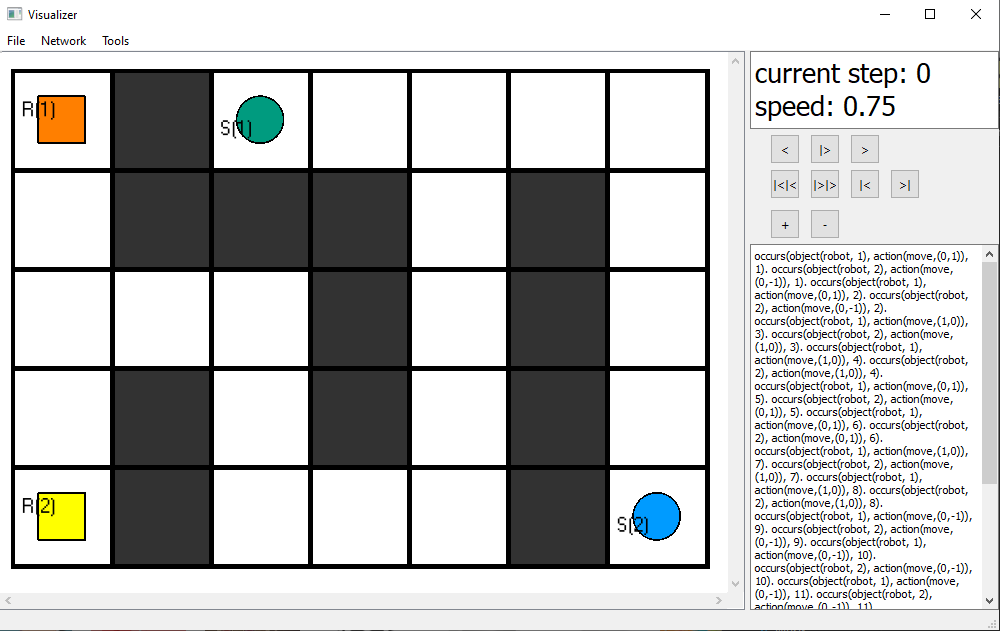

# Benchmark Tool

This is a benchmark instance creation tool written in python with GUI for intuitive, quick and easy creation of your custom M-domain benchmark.

To open the tool, simply run the `python benchmark_tool.py` command or execute either `run_win.bat`, `run_linux.sh` or `run_mac.command` for your respective platform.

The `output/` directory is the destination of all exported files.

### Requirements:
- python3.9 or greater
- tkinter library
- numpy library

## An image of the editor:

## An image of the plan editing process:

## The exported instance and plans loaded into the asprilo vizualizer:

