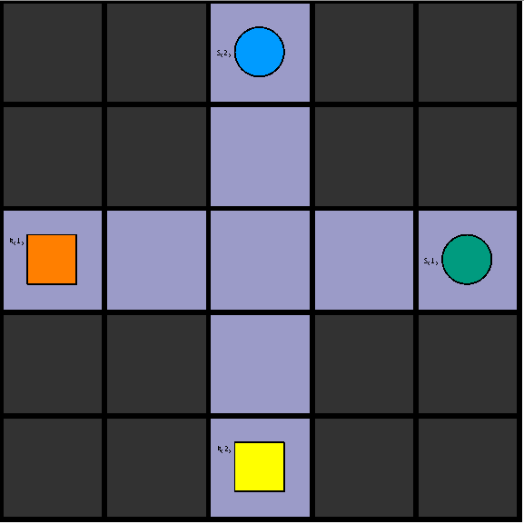

# Benchmark 3

This is our third benchmark on a 5x5 grid with two corridors and 2 robots on two ends. On the opposite ends there are two shelves with a product in them. If both robots will simply go straight towards a shelf, they will crash and cause a vertex collision conflict.

