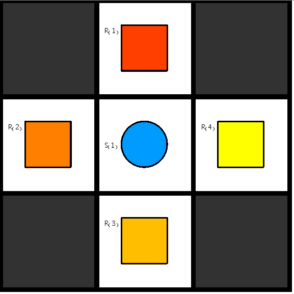

This is our third benchmark on a 3x3 grid with two corridors and 4 robots, one on each side. In the center there is one shelf with one product. If more than one robot will move towards the shelf at once, it will result in a crash.

