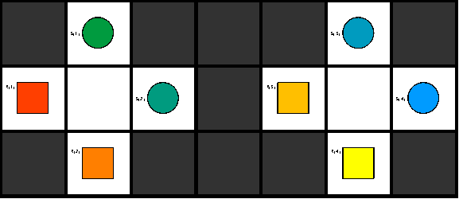

# Benchmark 6

This is our sixth benchmark on a 7x3 grid with 4 robots. The field is divided into two halves with two robots each. Each half will cause a vertex collision conflict between two robots after the first time step.

