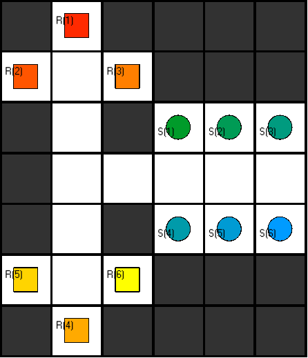

# Benchmark 8

This is a more interesting benchmark on a 6x7 grid with 6 robots causing lots of collisions. Two spacially seperated three-robot vertex collisions at time step 1 and a few temporally delayed two-robot vertex collisions after that.
Our `merger_waiting_improved3.lp` encoding encounters 5 temporal conflicts and solves the problem within 5 conflict layers and a horizon of 12.

