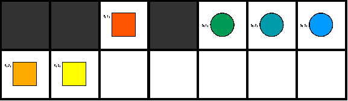

# Benchmark 9

This is a benchmark on a 7x2 grid with 3 robots. It is meant to test which robot needs to wait in a vertex collision conflict as this instance will result in a crash between robot 2 and 3 if solely the number of the robot gets used as priority with robot 1 being the highest priority.

